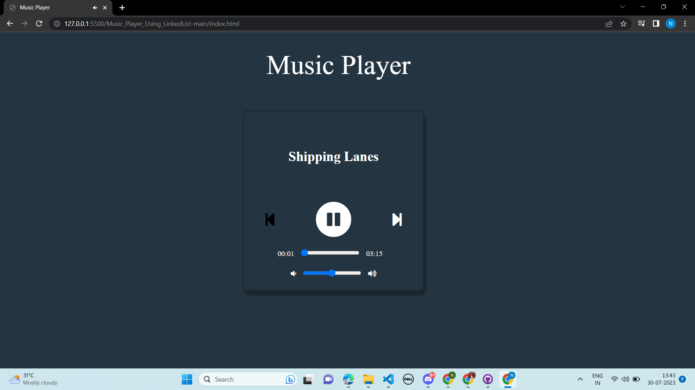

<!-- Author : Nikanshu Goyal -->

<h1> Music Player using Doubly Linked List</h1>

- This webapp uses Doubly Linked List for implementing music player
- Made with JavaScript, HTML and CSS3.
- Live Demo:👇

- [x] 

## Project Overview:

The Music Player Using Doubly Linked List is a web-based application that allows users to manage and play their music playlists efficiently. 
The project combines the power of data structures with HTML, CSS, and JavaScript to create an intuitive user interface and seamless playback experience.

## Aout the application

*The doubly linked list data structure is used to maintain the order of songs and facilitate easy navigation through the playlist.

*Each song in the playlist is represented by a node in the doubly linked list. The node contains essential metadata, such as the song title, artist, album, and duration.

*Users can play, pause, and skip songs in the playlist using intuitive controls provided by the user interface. The current playing song is visually highlighted in the playlist.
*The user interface is designed to be responsive, ensuring a seamless experience across various devices, including desktops, tablets, and mobile phones.

- [x] Home Page:

